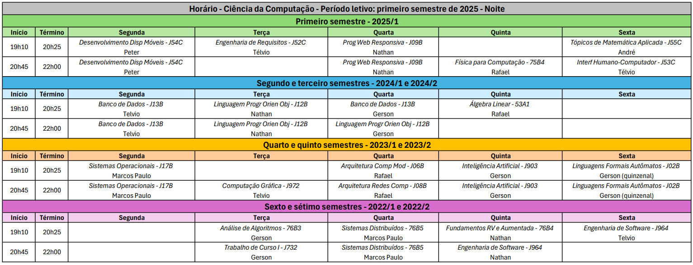

<h1>Ciência da Computação - UNIP</h1>

Repositório para organização de Slides/Conteúdos das aulas, atividades, e avaliações.

<h2 style="text-align:center">Datas e Horários</h2>

  
<h2>1° Semestre</h2>

  

    
<h3>Disciplinas Presenciais</h3>

  

  

    
<h3>Disciplinas Presenciais</h3>

  

<h2>1° Semestre</h2>
  <ul>
    <li><h3>Disciplinas Presenciais</h3></li>
      <ul>
        <li><a href="1° Semestre/Disciplinas Presenciais/Física para Computação - Presencial">Física para Computação</a></li>
        <li><a href="1° Semestre/Disciplinas Presenciais/Interface Humano Computador - Presencial">Interface Humano Computador</a></li>
        <li><a href="1° Semestre/Disciplinas Presenciais/Noções de Direito - Presencial">Noções de Direito</a></li>
        <li><a href="1° Semestre/Disciplinas Presenciais/Programação para Dispositivos Móveis - Presencial">Programação para Dispositivos Móveis</a></li>
        <li><a href="1° Semestre/Disciplinas Presenciais/Programacao Web Responsiva - Presencial">Programacao Web Responsiva</a></li>
      </ul>
    <li><h3>Disciplinas Online - AVA</h3></li>
      <ul>
        <li><a href="1° Semestre/Disciplinas Online - AVA/Interpretação e Produção de Textos - AVA">Interpretação e Produção de Textos</a></li>
        <li><a href="1° Semestre/Disciplinas Online - AVA/Tópicos de Ambiente Web - AVA">Tópicos de Ambiente Web</a></li>
        <li><a href="1° Semestre/Disciplinas Online - AVA/Tópicos de Matemática Aplicada - AVA">Tópicos de Matemática Aplicada</a></li>
      </ul>
    <li><h3>Atividades Práticas Supervisionadas - APS</h3></li>
      <ul>
        <li><a href="1° Semestre/APS">APS 1° Semestre - Sustentabilidade</a></li>
      </ul>
  </ul>

  <h2>2° Semestre</h2>
   <ul>
    <li><h3>Disciplinas Presenciais</h3></li>
      <ul>
        <li><a href="2° Semestre/Disciplinas Presenciais/Circuitos Lógicos Digitais">Circuitos Lógicos Digitais</a></li>
        <li><a href="2° Semestre/Disciplinas Presenciais/Introdução a Programação Estruturada">Introdução a Programação Estruturada</a></li>
        <li><a href="2° Semestre/Disciplinas Presenciais/Lógica de Programação e Algoritmos">Lógica de Programação e Algoritmos</a></li>
      </ul>
    <li><h3>Disciplinas Online - AVA</h3></li>
      <ul>
        <li><a href="2° Semestre/Disciplinas Online - AVA/Geometria Analítica">Geometria Analítica</a></li>
        <li><a href="2° Semestre/Disciplinas Online - AVA/Lógica Matemática">Lógica Matemática</a></li>
        <li><a href="2° Semestre/Disciplinas Online - AVA/Comunicação e Expressão">Comunicação e Expressão</a></li>
      </ul>
    <li><h3>Atividades Práticas Supervisionadas - APS</h3></li>
      <ul>
        <li><a href="2° Semestre/APS">APS 2° Semestre - Criptografia</a></li>
      </ul>
    </ul>
